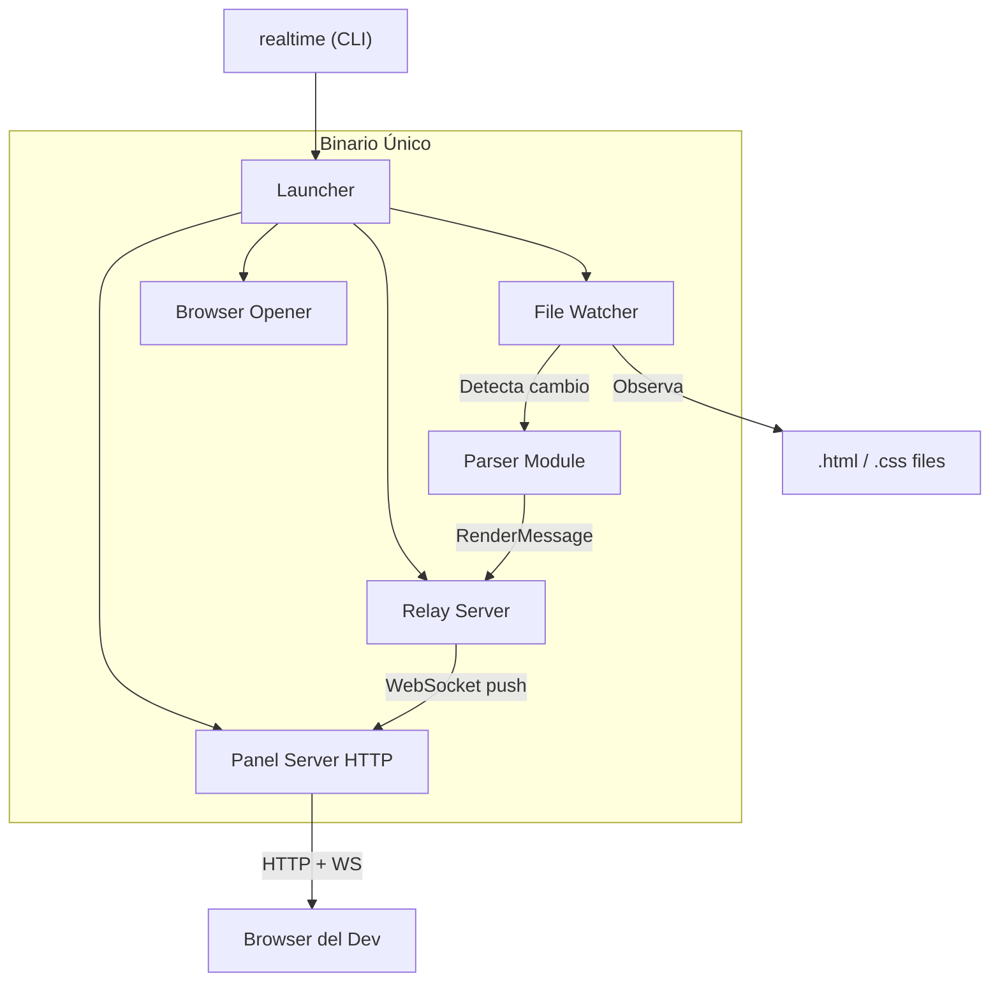
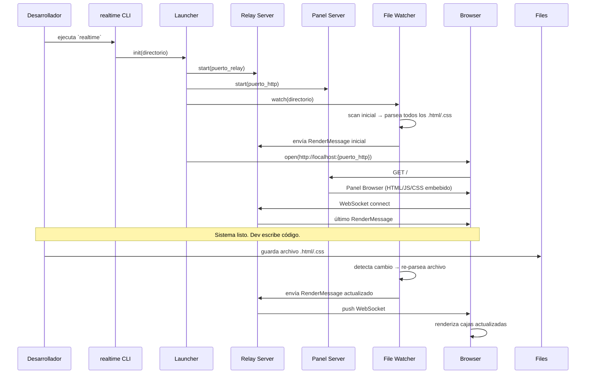

# Design Document: One-Click Experience

## Overview

Transformar Real Time de un sistema de 3 terminales manuales a un binario único que arranca todo con un solo comando. El desarrollador ejecuta `realtime` (o `realtime ./mi-proyecto`) y el sistema levanta el relay, el file watcher, el servidor HTTP del panel, y abre el browser automáticamente. El dev empieza a escribir código y ve la representación visual en tiempo real.

## Architecture



### Flujo de arranque



## Components and Interfaces

### Launcher

Orquestador principal. Arranca todos los componentes en orden y maneja el shutdown limpio.

```rust
pub struct Launcher {
    work_dir: PathBuf,
    relay_port: u16,
    http_port: u16,
}

impl Launcher {
    pub async fn start(&self) -> Result<(), Box<dyn Error>> {
        // 1. Buscar puertos disponibles
        // 2. Arrancar relay server (background task)
        // 3. Arrancar panel server HTTP (background task)
        // 4. Arrancar file watcher (background task)
        // 5. Scan inicial de archivos
        // 6. Abrir browser
        // 7. Esperar Ctrl+C
        // 8. Shutdown limpio
    }
}
```

**Librerías:**
- `webbrowser` crate para abrir el browser del sistema ([lib.rs](https://lib.rs/crates/webbrowser))
- `ctrlc` crate para manejar señales de shutdown

### File Watcher

Observa el directorio de trabajo y dispara re-parsing cuando detecta cambios.

```rust
pub struct FileWatcher {
    work_dir: PathBuf,
    sender: broadcast::Sender<FileEvent>,
    file_cache: HashMap<PathBuf, ParsedFile>,
}

pub enum FileEvent {
    Changed(PathBuf),
    Created(PathBuf),
    Deleted(PathBuf),
}

pub struct ParsedFile {
    pub path: PathBuf,
    pub objects: Vec<ObjetoHtml>,    // si es .html
    pub directives: Vec<Directriz>,  // si es .css
}
```

**Librería:** `notify` crate v8 para filesystem watching cross-platform ([github](https://github.com/notify-rs/notify))

**Comportamiento:**
- Observa recursivamente el directorio de trabajo
- Filtra solo `.html` y `.css`
- Ignora: `node_modules`, `.git`, `target`, `dist`, `build`
- Debounce de 100ms para agrupar cambios rápidos
- Mantiene un cache de archivos parseados para re-parsing incremental

### Panel Server (HTTP embebido)

Sirve el Panel Browser como archivos estáticos embebidos en el binario.

```rust
pub struct PanelServer {
    port: u16,
}
```

**Estrategia de embedding:** Usar `include_str!` o `rust-embed` para embeber los archivos HTML/JS/CSS del panel browser directamente en el binario en tiempo de compilación. Así no hay archivos externos que distribuir.

**Librería:** `axum` + `tower-http` para el servidor HTTP. Los assets del panel se embeben con `rust-embed`.

**Rutas:**
- `GET /` → `index.html` del panel browser
- `GET /assets/*` → JS/CSS del panel browser
- WebSocket proxy al relay (o el browser se conecta directo al relay)

### Project Scanner

Escanea el directorio de trabajo al inicio para encontrar todos los archivos relevantes.

```rust
pub fn scan_project(dir: &Path) -> Vec<PathBuf> {
    // Walk recursivo
    // Filtrar .html y .css
    // Ignorar directorios excluidos
    // Retornar lista de paths
}
```

### Browser Opener

Abre el browser predeterminado del sistema.

```rust
pub fn open_browser(url: &str) -> Result<(), Box<dyn Error>> {
    webbrowser::open(url)?;
    Ok(())
}
```

### Consolidador de RenderMessage

Combina los resultados de múltiples archivos en un solo RenderMessage.

```rust
pub struct MessageConsolidator {
    files: HashMap<PathBuf, ParsedFile>,
}

impl MessageConsolidator {
    /// Actualiza un archivo y retorna el RenderMessage consolidado.
    pub fn update_file(&mut self, path: PathBuf, parsed: ParsedFile) -> RenderMessage {
        self.files.insert(path, parsed);
        self.consolidate()
    }
    
    /// Elimina un archivo y retorna el RenderMessage consolidado.
    pub fn remove_file(&mut self, path: &Path) -> RenderMessage {
        self.files.remove(path);
        self.consolidate()
    }
    
    fn consolidate(&self) -> RenderMessage {
        let mut objects = Vec::new();
        let mut directives = Vec::new();
        for file in self.files.values() {
            objects.extend(file.objects.clone());
            directives.extend(file.directives.clone());
        }
        RenderMessage { objects, directives, timestamp: now() }
    }
}
```


## Data Models

### FileEvent (nuevo)

```rust
#[derive(Debug, Clone)]
pub enum FileEvent {
    Changed(PathBuf),
    Created(PathBuf),
    Deleted(PathBuf),
}
```

### ParsedFile (nuevo)

```rust
#[derive(Debug, Clone)]
pub struct ParsedFile {
    pub path: PathBuf,
    pub file_type: FileType,
    pub objects: Vec<ObjetoHtml>,
    pub directives: Vec<Directriz>,
}

#[derive(Debug, Clone, PartialEq)]
pub enum FileType {
    Html,
    Css,
}
```

### ObjetoHtml (extendido)

```rust
// Se agrega source_file para trazar origen
#[derive(Debug, Clone, Serialize, Deserialize, PartialEq)]
pub struct ObjetoHtml {
    pub id: String,
    pub tag: String,
    pub children: Vec<ObjetoHtml>,
    pub attributes: Vec<(String, String)>,
    pub source_file: Option<String>,  // NUEVO: path del archivo origen
}
```

### RenderMessage (sin cambios)

Se mantiene igual. El consolidador combina objetos y directrices de múltiples archivos en un solo mensaje.

## CLI Interface

```
USAGE:
    realtime [OPTIONS] [DIRECTORY]

ARGS:
    <DIRECTORY>    Directorio de trabajo (default: directorio actual)

OPTIONS:
    -p, --port <PORT>      Puerto del panel browser (default: 3000)
    -r, --relay <PORT>     Puerto del relay (default: 9001)
    --no-open              No abrir browser automáticamente
    -h, --help             Mostrar ayuda
    -V, --version          Mostrar versión
```

**Librería:** `clap` para parsing de argumentos CLI.

## Distribución

### Compilación cross-platform

Usar `cross` o GitHub Actions para compilar binarios para:
- `x86_64-unknown-linux-gnu` (Linux)
- `x86_64-apple-darwin` (macOS Intel)
- `aarch64-apple-darwin` (macOS Apple Silicon)
- `x86_64-pc-windows-msvc` (Windows)

### Instalación

Opciones para el dev:
1. Descargar binario desde GitHub Releases
2. `cargo install realtime` (para devs Rust)
3. Script de instalación: `curl -fsSL https://realtime.dev/install.sh | sh`


## Correctness Properties

*A property is a characteristic or behavior that should hold true across all valid executions of a system—essentially, a formal statement about what the system should do. Properties serve as the bridge between human-readable specifications and machine-verifiable correctness guarantees.*

### Property 1: CLI directory resolution

*For any* valid path (absolute or relative), when passed as argument to the CLI, the resolved work directory SHALL match the canonical form of that path. When no argument is provided, the work directory SHALL be the current working directory.

**Validates: Requirements 1.4, 1.5**

### Property 2: Port fallback on conflict

*For any* requested port that is already in use, the Launcher SHALL select an alternative port that is available and different from the requested one.

**Validates: Requirements 2.4**

### Property 3: Recursive file scanning finds all HTML/CSS

*For any* directory tree containing `.html` and `.css` files at arbitrary depths, the Project_Scanner SHALL return exactly the set of `.html` and `.css` files present in the tree (excluding ignored directories).

**Validates: Requirements 3.1**

### Property 4: File upsert updates consolidated message

*For any* set of parsed files and any new or modified file, updating the MessageConsolidator with that file SHALL produce a RenderMessage that contains the objects/directives from the updated file alongside all other existing files.

**Validates: Requirements 3.2, 3.3**

### Property 5: File deletion removes from consolidated message

*For any* set of parsed files and any file within that set, removing it from the MessageConsolidator SHALL produce a RenderMessage that does not contain any objects or directives originating from the removed file, while preserving all others.

**Validates: Requirements 3.4**

### Property 6: Ignored directories are excluded from scanning

*For any* directory tree where some files are inside ignored directories (node_modules, .git, target, dist, build), the Project_Scanner SHALL not include those files in the scan results.

**Validates: Requirements 3.5**

### Property 7: Consolidation includes all objects and directives

*For any* set of parsed files, the consolidated RenderMessage SHALL contain exactly the union of all ObjetoHtml objects from all HTML files and all Directrices from all CSS files, with no duplicates and no omissions.

**Validates: Requirements 5.1, 5.2**

### Property 8: Incremental update preserves other files

*For any* set of parsed files and any single file update, the objects and directives from all non-updated files SHALL remain identical in the consolidated RenderMessage before and after the update.

**Validates: Requirements 5.3**

## Error Handling

### Port Conflicts
- Si el puerto solicitado está ocupado, el Launcher prueba puertos incrementales (port+1, port+2, ...) hasta encontrar uno libre, con un máximo de 100 intentos.

### Directorio Inválido
- Si el directorio de trabajo no existe o no es accesible, el CLI muestra un error claro y termina con exit code 1.

### Sin Archivos HTML/CSS
- Si el scan inicial no encuentra archivos, el sistema arranca igual y muestra un canvas vacío. El file watcher sigue activo esperando que se creen archivos.

### File Watcher Errors
- Si el file watcher pierde acceso a un archivo durante el parsing, se ignora ese archivo y se mantiene el último estado conocido.

### Shutdown
- Ctrl+C dispara shutdown graceful: cierra WebSocket connections, detiene el file watcher, libera puertos.

## Testing Strategy

### Framework y Herramientas

- **Rust**: `cargo test` con `proptest` para property-based testing
- **Integración**: Tests con directorios temporales (`tempdir` crate)

### Property-Based Testing

Cada propiedad se implementa como test con `proptest`:
- Mínimo 100 iteraciones por propiedad
- Cada test anotado con: **Feature: one-click-experience, Property {N}: {título}**
- Generadores que producen estructuras de directorio y archivos aleatorios

### Unit Testing

Tests unitarios para:
- CLI argument parsing
- Port detection
- File scanning con directorios reales temporales
- MessageConsolidator operations
- Shutdown signal handling
