# Design Document — Real Time: Roadmap hacia Open Source

## Overview

Este diseño cubre los cambios necesarios para llevar Real Time desde MVP funcional con PSDOM implementado hasta un producto open source descargable. Se organiza en cuatro fases: completar el núcleo CSS, polish del panel, robustez/distribución, y documentación/lanzamiento.

El estado actual del sistema:
- Pipeline completo funcionando: CLI → scanner → parser → consolidator → relay → panel browser → canvas
- PSDOM implementado y testeado (46 tests, 9 propiedades de correctitud)
- PSDOM **no conectado** en el panel real (`index.html` usa LayoutEngine directo sin PSDOM)
- `WebSocketClient` existe pero `index.html` usa WebSocket inline
- CSS parser no soporta selectores agrupados (`h1, h2 {}`)
- `Directriz` no tiene `source_file`
- DirectiveApplicator solo maneja 7 propiedades
- Canvas fijo 800×600

## Architecture

El pipeline actual no cambia en estructura. Los cambios son:

```mermaid
graph LR
    subgraph "Rust (sin cambios estructurales)"
        SC[Scanner] --> FW[FileWatcher]
        FW --> P[Parser]
        P --> C[Consolidator]
        C --> R[Relay]
    end

    subgraph "Panel Browser (cambios principales)"
        R -->|WebSocket| WS[WebSocketClient]
        WS --> PS[PSDOM.resolve]
        PS -->|Map id→Directriz| LE[LayoutEngine]
        LE --> DA[DirectiveApplicator]
        DA --> BR[BoxRenderer]
        BR --> CV[Canvas responsivo]
    end

    style WS fill:#ffd,stroke:#333
    style PS fill:#ffd,stroke:#333
    style DA fill:#ffd,stroke:#333
    style BR fill:#ffd,stroke:#333
    style CV fill:#ffd,stroke:#333
```



Los nodos amarillos son los que cambian. El flujo Rust permanece igual excepto por el campo `source_file` en `Directriz`.

## Components and Interfaces

### Fase 1: Completar el núcleo CSS

#### 1.5 — source_file en Directriz

Cambio cross-crate que atraviesa Rust → serde → TypeScript.

**shared/src/lib.rs** — Agregar campo opcional:
```rust
pub struct Directriz {
    pub selector: String,
    pub property: String,
    pub value: String,
    #[serde(default, skip_serializing_if = "Option::is_none")]
    pub source_file: Option<String>,
}
```

**realtime-cli/src/consolidator.rs** — En `update_file`, tagear directrices igual que objetos:
```rust
pub fn update_file(&mut self, parsed: ParsedFile) -> RenderMessage {
    let mut tagged = parsed.clone();
    let source = tagged.path.file_name()
        .and_then(|n| n.to_str())
        .unwrap_or("unknown")
        .to_string();
    for obj in &mut tagged.objects {
        set_source_file(obj, &source);
    }
    for dir in &mut tagged.directives {
        dir.source_file = Some(source.clone());
    }
    self.files.insert(tagged.path.clone(), tagged);
    self.consolidate()
}
```

**panel-browser/src/types.ts** — Agregar campo:
```typescript
export interface Directriz {
  selector: string;
  property: string;
  value: string;
  source_file?: string;
}
```

**panel-browser/src/psdom/psdom.ts** — Actualizar `DirectiveConflict` para incluir `source_file`:
```typescript
export interface DirectiveConflict {
  nodeId: string;
  property: string;
  candidates: {
    selector: string;
    value: string;
    specificity: Specificity;
    sourceFile?: string;  // nuevo
  }[];
}
```

#### 1.6 — Selectores agrupados en CSS Parser

El CSS parser actual lee un selector como string hasta `{`. Para selectores agrupados (`h1, h2, h3 { color: red; }`), el selector se lee como `"h1, h2, h3"`. El cambio es: después de leer el selector y las declaraciones, si el selector contiene comas, emitir una Directriz por cada selector individual × cada declaración.

```rust
// Después de leer selector y declaraciones:
let selectors: Vec<&str> = selector.split(',')
    .map(|s| s.trim())
    .filter(|s| !s.is_empty())
    .collect();

for sel in &selectors {
    for (property, value) in &declarations {
        directives.push(Directriz {
            selector: sel.to_string(),
            property: property.clone(),
            value: value.clone(),
            source_file: None,
        });
    }
}
```

El pretty printer necesita agrupar directrices con mismas declaraciones bajo un selector agrupado para el round-trip.

#### 1.7 — Integración PSDOM en index.html

Reescribir `index.html` para usar los módulos existentes:

```typescript
import { PSDOM } from './src/psdom';
import { LayoutEngine } from './src/layout-engine';
import { applyDirectives } from './src/directive-applicator';
import { BoxRenderer } from './src/box-renderer';

const psdom = new PSDOM();
const engine = new LayoutEngine(canvas.width, canvas.height);
const renderer = new BoxRenderer();

// En cada mensaje:
const { directives: resolvedMap, invalidSelectors, conflicts } = psdom.resolve(msg.objects, msg.directives);
const layout = engine.computeLayout(msg.objects, msg.directives, resolvedMap);
const withDirectives = applyDirectives(layout);
renderer.renderToCanvas(ctx, withDirectives);

// Mostrar diagnóstico en status bar
status.textContent = `Connected | ${msg.objects.length} objects | ${invalidSelectors.length} invalid | ${conflicts.length} conflicts`;
```

### Fase 2: Polish del panel

#### 2.1 — Propiedades CSS adicionales en DirectiveApplicator

Agregar cases al switch en `applyDirective`:

| Propiedad | Efecto en LayoutNode |
|-----------|---------------------|
| `padding-top/right/bottom/left` | Offset de posición de hijos |
| `display: none` | Marcar nodo como hidden, excluir de layout |
| `border-radius` | Almacenar en directivas para BoxRenderer |
| `opacity` | Almacenar en directivas para BoxRenderer |
| `max-width` | `node.width = Math.min(node.width, maxWidth)` |
| `min-height` | `node.height = Math.max(node.height, minHeight)` |
| `font-size`, `color` | Almacenar en directivas para BoxRenderer |
| `margin` (shorthand) | Descomponer en margin-top/right/bottom/left |

Para `display: none`, agregar un campo `hidden: boolean` a `LayoutNode` y que el BoxRenderer lo respete.

#### 2.2 — Mejoras visuales del BoxRenderer

Extender `RenderCommand` con campos opcionales:

```typescript
export interface RenderCommand {
  type: 'rect' | 'text';
  x: number;
  y: number;
  width?: number;
  height?: number;
  label?: string;
  strokeColor?: string;
  fillColor?: string;
  borderRadius?: number;    // nuevo
  opacity?: number;         // nuevo
  borderWidth?: number;     // nuevo
  fontSize?: string;        // nuevo
  textColor?: string;       // nuevo
}
```

En `renderToCanvas`, usar `ctx.roundRect()` cuando `borderRadius` está presente, `ctx.globalAlpha` para opacity.

#### 2.3 — Canvas responsivo

```typescript
function resizeCanvas() {
  canvas.width = window.innerWidth;
  canvas.height = window.innerHeight;
  engine = new LayoutEngine(canvas.width, canvas.height);
  // Re-render con último mensaje
  if (lastMessage) renderMessage(lastMessage);
}

let resizeTimer: number;
window.addEventListener('resize', () => {
  clearTimeout(resizeTimer);
  resizeTimer = setTimeout(resizeCanvas, 150);
});
```

Guardar el último `RenderMessage` recibido para re-renderizar en resize.

#### 2.4 — Indicadores de estado

El status bar actual ya muestra "Connected | N objects | N directives | N files". Extender con:
- Conteo de selectores inválidos descartados
- Conteo de conflictos detectados
- Indicación visual en cajas con conflictos (borde rojo punteado)

### Fase 3: Robustez y distribución

#### 3.1 — Build pipeline

Crear `build.sh` en la raíz:
```bash
#!/bin/bash
set -e
echo "Building panel-browser..."
(cd panel-browser && npm run build)
echo "Building realtime binary..."
cargo build --release
echo "Done: target/release/realtime"
```

El `panel_server.rs` ya embebe `../panel-browser/dist/` via `rust_embed`. Solo necesita que `dist/` exista antes de `cargo build`.

#### 3.2 — GitHub Actions CI

```yaml
# .github/workflows/ci.yml
name: CI
on: [push, pull_request]
jobs:
  test:
    runs-on: ubuntu-latest
    steps:
      - uses: actions/checkout@v4
      - uses: actions/setup-node@v4
      - uses: dtolnay/rust-toolchain@stable
      - run: cd panel-browser && npm ci && npm test
      - run: cd panel-browser && npm run build
      - run: cargo test --workspace

  release:
    needs: test
    if: startsWith(github.ref, 'refs/tags/v')
    strategy:
      matrix:
        include:
          - target: x86_64-unknown-linux-gnu
            os: ubuntu-latest
          - target: x86_64-apple-darwin
            os: macos-latest
          - target: aarch64-apple-darwin
            os: macos-latest
          - target: x86_64-pc-windows-msvc
            os: windows-latest
    runs-on: ${{ matrix.os }}
    steps:
      - uses: actions/checkout@v4
      - uses: actions/setup-node@v4
      - uses: dtolnay/rust-toolchain@stable
        with:
          targets: ${{ matrix.target }}
      - run: cd panel-browser && npm ci && npm run build
      - run: cargo build --release --target ${{ matrix.target }}
      - uses: softprops/action-gh-release@v1
        with:
          files: target/${{ matrix.target }}/release/realtime*
```

#### 3.3 — Script de instalación

```bash
#!/bin/sh
set -e
OS=$(uname -s | tr '[:upper:]' '[:lower:]')
ARCH=$(uname -m)
case "$OS-$ARCH" in
  linux-x86_64)  TARGET="x86_64-unknown-linux-gnu" ;;
  darwin-x86_64) TARGET="x86_64-apple-darwin" ;;
  darwin-arm64)  TARGET="aarch64-apple-darwin" ;;
  *) echo "Unsupported: $OS-$ARCH"; exit 1 ;;
esac
VERSION=$(curl -s https://api.github.com/repos/OWNER/realtime/releases/latest | grep tag_name | cut -d'"' -f4)
curl -fsSL "https://github.com/OWNER/realtime/releases/download/$VERSION/realtime-$TARGET" -o /usr/local/bin/realtime
chmod +x /usr/local/bin/realtime
echo "Real Time $VERSION installed"
```

### Fase 4: Documentación y lanzamiento

#### 4.1 — README.md

Estructura:
1. Qué es (2 párrafos)
2. GIF/video de 30 segundos
3. Instalación (3 comandos)
4. Uso básico
5. Lo que hace y lo que no hace
6. Arquitectura (diagrama simplificado)
7. Contribuir

#### 4.2 — CONTRIBUTING.md

- Cómo correr tests: `cd panel-browser && npm test` + `cargo test --workspace`
- Cómo compilar: `./build.sh`
- Cómo agregar una propiedad CSS al DirectiveApplicator
- Cómo agregar una propiedad heredable al InheritanceResolver

## Data Models

### Cambios a Directriz (Rust)

```rust
pub struct Directriz {
    pub selector: String,
    pub property: String,
    pub value: String,
    #[serde(default, skip_serializing_if = "Option::is_none")]
    pub source_file: Option<String>,
}
```

### Cambios a Directriz (TypeScript)

```typescript
export interface Directriz {
  selector: string;
  property: string;
  value: string;
  source_file?: string;
}
```

### Cambios a LayoutNode (TypeScript)

```typescript
export interface LayoutNode {
  id: string;
  tag: string;
  x: number;
  y: number;
  width: number;
  height: number;
  children: LayoutNode[];
  directives: Directriz[];
  zone: Zone;
  sourceFile?: string;
  hidden?: boolean;  // nuevo: display:none
}
```

### Cambios a RenderCommand (TypeScript)

```typescript
export interface RenderCommand {
  type: 'rect' | 'text';
  x: number;
  y: number;
  width?: number;
  height?: number;
  label?: string;
  strokeColor?: string;
  fillColor?: string;
  borderRadius?: number;
  opacity?: number;
  borderWidth?: number;
  fontSize?: string;
  textColor?: string;
}
```

## Correctness Properties

*A property is a characteristic or behavior that should hold true across all valid executions of a system—essentially, a formal statement about what the system should do. Properties serve as the bridge between human-readable specifications and machine-verifiable correctness guarantees.*

### Rust / proptest

### Property 1: source_file round-trip por archivo

*For any* conjunto de archivos CSS con paths distintos, el Consolidator SHALL producir Directrices donde cada una tiene `source_file` igual al nombre del archivo que la originó, y ninguna Directriz tiene el `source_file` de otro archivo.

**Validates: Requirements 1.3**

### Property 2: Independencia parser/consolidator

*For any* CSS string, el CSS_Parser SHALL producir Directrices con `source_file` ausente (`None`). El campo solo aparece después del Consolidator. El parser nunca lo setea.

**Validates: Requirements 1.2**

### Property 5: Expansión de selectores agrupados

*For any* regla CSS con N selectores agrupados por coma y M declaraciones, el parser SHALL producir exactamente N×M Directrices, una por cada combinación selector/propiedad.

**Validates: Requirements 3.1**

### Property 6: Round-trip de selectores agrupados

*For any* CSS válido con selectores agrupados, parsear → pretty-print → parsear SHALL producir el mismo conjunto de Directrices que el parse original (equivalencia, no igualdad de string).

**Validates: Requirements 3.4**

### Property 7: Tolerancia a ramas inválidas en grupos

*For any* selector agrupado donde al menos una rama es válida y al menos una es inválida, el parser SHALL producir Directrices para todas las ramas válidas y descartar silenciosamente las inválidas, sin afectar el resultado de las válidas.

**Validates: Requirements 3.2**

### Property 13: Orden determinista del Consolidator

*For any* conjunto de archivos CSS con paths distintos, el orden de las Directrices en el RenderMessage consolidado SHALL ser siempre el mismo independientemente del orden en que se insertaron los archivos en el Consolidator. El orden es por path alfabético.

**Validates: Requirements 11.4**

### TypeScript / fast-check

### Property 3: Equivalencia PSDOM vs matchDirectives para selectores simples

*For any* RenderMessage con selectores simples (tag, `.class`, `#id`), el resultado de `PSDOM.resolve()` SHALL producir el mismo mapping id→directrices que el `matchDirectives` original del LayoutEngine. Compatibilidad hacia atrás garantizada.

**Validates: Requirements 2.1**

### Property 4: PSDOM stateless entre RenderMessages

*For any* par de RenderMessages distintos procesados en secuencia, el resultado del segundo SHALL ser idéntico al resultado de procesarlo como primero en una instancia limpia. El estado del iframe no contamina ciclos subsiguientes.

**Validates: Requirements 2.1**

### Property 8: display:none elimina del layout

*For any* ObjetoHtml con directriz `display: none`, el LayoutNode resultante y todos sus descendientes SHALL estar ausentes del output del LayoutEngine. Ningún RenderCommand los referencia.

**Validates: Requirements 4.2**

### Property 9: max-width restringe sin exceder

*For any* ObjetoHtml con directriz `max-width: Xpx`, el ancho del LayoutNode resultante SHALL ser siempre menor o igual a X, independientemente del ancho base calculado por el LayoutEngine.

**Validates: Requirements 4.5**

### Property 10: Propiedad inválida preserva estado

*For any* LayoutNode con un valor de propiedad inválido, el DirectiveApplicator SHALL producir un nodo idéntico al que produciría sin esa directriz. El estado no cambia.

**Validates: Requirements 4.7**

### Property 11: Layout determinista por dimensiones

*For any* RenderMessage y cualquier par de dimensiones de canvas, el LayoutEngine SHALL producir siempre el mismo resultado dado el mismo input y las mismas dimensiones. El resize no introduce no-determinismo.

**Validates: Requirements 6.2**

### Property 12: Contenido dentro de los límites del canvas

*For any* RenderMessage y cualquier tamaño de canvas, todos los LayoutNodes SHALL tener x≥0, y≥0, x+width≤canvasWidth, y+height≤canvasHeight. Ningún elemento se renderiza fuera del canvas.

**Validates: Requirements 6.2**

## Error Handling

### CSS Parser — Selectores agrupados
- Si un selector individual dentro de un grupo tiene sintaxis inválida (e.g., `h1, !!!bad, h3 {}`), se descarta ese selector y se emiten Directrices para los válidos.
- Si todos los selectores del grupo son inválidos, no se emiten Directrices para esa regla.

### DirectiveApplicator — Valores inválidos
- El invariante existente se mantiene: sintaxis incorrecta no causa modificación. `parseDimension` ya retorna fallback para valores no parseables.
- `display: none` solo se activa con el valor exacto `"none"`. Cualquier otro valor de display se ignora en el MVP.

### Canvas resize
- Si `window.innerWidth` o `window.innerHeight` es 0 (minimizado), no se re-renderiza.
- El debounce de 150ms previene recomputación excesiva durante resize continuo.

### Build pipeline
- Si `panel-browser/dist/` no existe cuando se ejecuta `cargo build`, `rust_embed` falla con error claro. El `build.sh` ejecuta `npm run build` primero para prevenir esto.

## Testing Strategy

### Framework y herramientas

- **Rust**: `proptest` para property-based testing, tests unitarios estándar
- **TypeScript**: `vitest` con `fast-check` para property-based testing
- **Entorno TS**: `happy-dom` para tests que requieren DOM

### Property-Based Testing

Cada propiedad se implementa como test con mínimo 100 iteraciones.

**Rust / proptest** (6 properties):
- Property 1: source_file round-trip por archivo (Consolidator)
- Property 2: Independencia parser/consolidator (CSS Parser)
- Property 5: Expansión de selectores agrupados (CSS Parser)
- Property 6: Round-trip de selectores agrupados (CSS Parser)
- Property 7: Tolerancia a ramas inválidas en grupos (CSS Parser)
- Property 13: Orden determinista del Consolidator (Consolidator)

**TypeScript / fast-check** (7 properties):
- Property 3: Equivalencia PSDOM vs matchDirectives (ya implementada como Property 9 de PSDOM)
- Property 4: PSDOM stateless entre RenderMessages (ya implementada como Property 3 de PSDOM)
- Property 8: display:none elimina del layout (DirectiveApplicator + LayoutEngine)
- Property 9: max-width restringe sin exceder (DirectiveApplicator)
- Property 10: Propiedad inválida preserva estado (DirectiveApplicator)
- Property 11: Layout determinista por dimensiones (LayoutEngine)
- Property 12: Contenido dentro de los límites del canvas (LayoutEngine)

Cada test anotado con: **Feature: open-source-roadmap, Property {N}: {título}**

**Nota**: Properties 3 y 4 ya están implementadas en los tests de PSDOM (psdom-compat.test.ts y psdom.test.ts). No se reimplementan — se referencian como validación existente.

### Unit Testing

Tests unitarios complementarios para:
- Selectores agrupados: `h1, h2 {}`, `h1, .class, #id {}`, selector vacío en grupo
- source_file propagation: verificar campo presente después de consolidación
- DirectiveApplicator: cada nueva propiedad con valores específicos
- BoxRenderer: verificar que RenderCommands incluyen nuevos campos
- Canvas resize: verificar que LayoutEngine recibe nuevas dimensiones

### Tests de integración E2E

- Pipeline completo con CSS real usando combinadores + selectores agrupados
- Pipeline con selectores inválidos mezclados
- Pipeline con múltiples archivos CSS con conflictos
- Verificar que el orden del Consolidator es determinista

### Nota sobre tests existentes

Los 46 tests de PSDOM y los tests de Rust existentes deben seguir pasando sin modificación después de agregar `source_file` a `Directriz` (el campo es `Option` con `serde(default)`).
