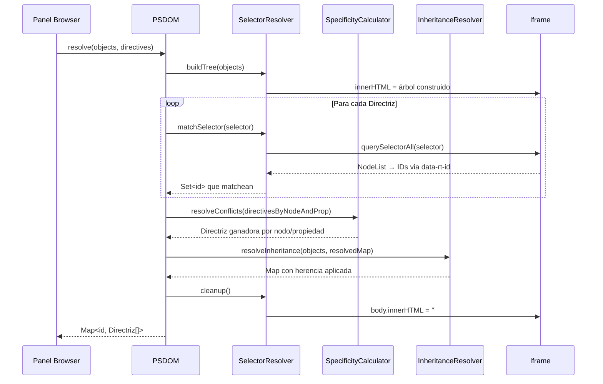

# Design Document: PSDOM (Proxy Shadow DOM)

## Overview

PSDOM resuelve el problema de selector matching limitado del Panel Browser. El `matchDirectives` actual del LayoutEngine solo soporta selectores simples (tag, `.class`, `#id`). CSS real tiene combinadores (`div > p`, `ul li`, `h1 + p`), pseudoclases estructurales (`:nth-child`, `:first-of-type`, `:not()`), selectores de atributo, especificidad, cascada y herencia. Reimplementar todo eso en TypeScript es un problema resuelto y complejo que no debería vivir en este sistema.

La solución: delegar la resolución de selectores al motor nativo del browser usando un iframe aislado, complementar con cálculo de especificidad como función matemática pura, y resolver herencia recorriendo el árbol de ObjetoHtml existente.

PSDOM se implementa como tres piezas ortogonales:

1. **SelectorResolver** — iframe permanente + `querySelectorAll` nativo
2. **SpecificityCalculator** — función pura `(a, b, c)` sin DOM
3. **InheritanceResolver** — tree walk sobre ObjetoHtml

Cada pieza es independiente, testeable por separado, y reemplazable sin tocar las otras.

## Architecture

```mermaid
graph TB
    RM[RenderMessage] --> PSDOM[PSDOM Orchestrator]
    
    subgraph "PSDOM Module"
        PSDOM --> SR[SelectorResolver]
        PSDOM --> SC[SpecificityCalculator]
        PSDOM --> IR[InheritanceResolver]
        
        SR -->|usa| IF[Iframe Aislado]
        IF -->|querySelectorAll| SR
        
        SC -->|función pura| SC
        IR -->|tree walk| OH[Árbol ObjetoHtml]
    end
    
    PSDOM -->|Map ID → Directriz[]| LE[LayoutEngine]
    LE --> DA[DirectiveApplicator]
    DA --> BR[BoxRenderer]
```

### Posición en el pipeline

PSDOM se inserta **antes** del LayoutEngine, reemplazando el `matchDirectives` privado actual. El flujo cambia de:

```
RenderMessage → LayoutEngine.matchDirectives(simple) → LayoutNode.directives → DirectiveApplicator → BoxRenderer
```

A:

```
RenderMessage → PSDOM.resolve(objects, directives) → Map<id, Directriz[]> → LayoutEngine(usa mapa) → DirectiveApplicator → BoxRenderer
```

El LayoutEngine deja de hacer matching propio y consume el mapa pre-resuelto por PSDOM.

### Flujo de un ciclo PSDOM



## Components and Interfaces

### SelectorResolver

Responsable de construir el árbol DOM en el iframe y ejecutar querySelectorAll nativo.

```typescript
export class SelectorResolver {
  private iframe: HTMLIFrameElement;

  constructor() {
    // Crea iframe permanente, invisible, aislado
    this.iframe = document.createElement('iframe');
    this.iframe.srcdoc = '';
    this.iframe.style.cssText = 'position:absolute;width:0;height:0;border:0;visibility:hidden;';
    document.body.appendChild(this.iframe);
  }

  /** Construye el árbol DOM desde ObjetoHtml[] dentro del iframe */
  buildTree(objects: ObjetoHtml[]): void {
    const doc = this.iframe.contentDocument!;
    doc.body.innerHTML = '';
    for (const obj of objects) {
      doc.body.appendChild(this.createNode(doc, obj));
    }
  }

  /** Ejecuta querySelectorAll y retorna IDs de ObjetoHtml que matchean */
  matchSelector(selector: string): SelectorResult {
    const doc = this.iframe.contentDocument!;
    try {
      const nodes = doc.querySelectorAll(selector);
      const ids: string[] = [];
      nodes.forEach(n => {
        const id = (n as HTMLElement).dataset.rtId;
        if (id) ids.push(id);
      });
      return { valid: true, ids };
    } catch {
      return { valid: false, ids: [], invalidSelector: selector };
    }
  }

  /** Limpia el contenido del iframe */
  cleanup(): void {
    this.iframe.contentDocument!.body.innerHTML = '';
  }

  private createNode(doc: Document, obj: ObjetoHtml): HTMLElement {
    const el = doc.createElement(obj.tag);
    el.dataset.rtId = obj.id;
    for (const [key, value] of obj.attributes) {
      if (key === 'id') el.id = value;
      else if (key === 'class') el.className = value;
      else el.setAttribute(key, value);
    }
    for (const child of obj.children) {
      el.appendChild(this.createNode(doc, child));
    }
    return el;
  }
}
```

### SpecificityCalculator

Función pura que calcula especificidad como tupla `(a, b, c)`.

```typescript
export type Specificity = [number, number, number];

/**
 * Calcula la especificidad de un selector CSS.
 * a = número de selectores de ID (#foo)
 * b = número de selectores de clase (.foo), atributo ([href]), pseudoclase (:hover)
 * c = número de selectores de elemento (div) y pseudoelemento (::before)
 */
export function calculateSpecificity(selector: string): Specificity {
  let a = 0, b = 0, c = 0;

  // Remover contenido de :not() pero contar su interior
  const withoutNot = selector.replace(/:not\(([^)]+)\)/g, (_, inner) => {
    const [ia, ib, ic] = calculateSpecificity(inner);
    a += ia; b += ib; c += ic;
    return '';
  });

  // Contar IDs: #identifier
  a += (withoutNot.match(/#[a-zA-Z_][\w-]*/g) || []).length;

  // Contar clases, atributos, pseudoclases
  b += (withoutNot.match(/\.[a-zA-Z_][\w-]*/g) || []).length;
  b += (withoutNot.match(/\[[^\]]+\]/g) || []).length;
  b += (withoutNot.match(/:[a-zA-Z][\w-]*(\([^)]*\))?/g) || []).length;

  // Contar elementos y pseudoelementos
  c += (withoutNot.match(/::[a-zA-Z][\w-]*/g) || []).length;
  // Elementos: tokens que no empiezan con #, ., :, [, *, >, +, ~
  const tokens = withoutNot.replace(/[>+~]/g, ' ').trim().split(/\s+/);
  for (const token of tokens) {
    const clean = token.replace(/#[a-zA-Z_][\w-]*/g, '')
                       .replace(/\.[a-zA-Z_][\w-]*/g, '')
                       .replace(/\[[^\]]+\]/g, '')
                       .replace(/::[a-zA-Z][\w-]*/g, '')
                       .replace(/:[a-zA-Z][\w-]*(\([^)]*\))?/g, '')
                       .replace(/\*/g, '');
    if (clean.match(/^[a-zA-Z][\w-]*$/)) c++;
  }

  return [a, b, c];
}

/** Compara dos especificidades. Retorna >0 si a gana, <0 si b gana, 0 si empate */
export function compareSpecificity(a: Specificity, b: Specificity): number {
  if (a[0] !== b[0]) return a[0] - b[0];
  if (a[1] !== b[1]) return a[1] - b[1];
  return a[2] - b[2];
}

/** Dada una lista de directrices para el mismo nodo/propiedad, retorna la ganadora */
export function resolveBySpecificity(directives: Directriz[]): Directriz {
  return directives.reduce((winner, current, index) => {
    const cmp = compareSpecificity(
      calculateSpecificity(current.selector),
      calculateSpecificity(winner.selector)
    );
    // Si mayor especificidad, o igual especificidad y viene después → gana
    return cmp > 0 || (cmp === 0) ? current : winner;
  });
}
```

### InheritanceResolver

Recorre el árbol de ObjetoHtml para propagar propiedades heredables.

```typescript
const INHERITABLE_PROPERTIES = new Set([
  'color', 'font-family', 'font-size', 'font-weight', 'font-style',
  'line-height', 'text-align', 'visibility', 'cursor',
  'letter-spacing', 'word-spacing',
]);

const CSS_DEFAULTS: Record<string, string> = {
  'color': 'black',
  'font-family': 'serif',
  'font-size': '16px',
  'font-weight': 'normal',
  'font-style': 'normal',
  'line-height': 'normal',
  'text-align': 'start',
  'visibility': 'visible',
  'cursor': 'auto',
  'letter-spacing': 'normal',
  'word-spacing': 'normal',
};

export function isInheritable(property: string): boolean {
  return INHERITABLE_PROPERTIES.has(property);
}

/**
 * Resuelve herencia para un nodo dado su mapa de directrices resueltas
 * y la cadena de ancestros.
 */
export function resolveInheritance(
  nodeId: string,
  resolvedMap: Map<string, Directriz[]>,
  ancestorChain: string[],  // IDs de ancestros, del más cercano al más lejano
): Directriz[] {
  const nodeDirectives = resolvedMap.get(nodeId) || [];
  const explicitProps = new Set(nodeDirectives.map(d => d.property));
  const inherited: Directriz[] = [];

  for (const prop of INHERITABLE_PROPERTIES) {
    if (explicitProps.has(prop)) continue;

    // Buscar en ancestros
    let found = false;
    for (const ancestorId of ancestorChain) {
      const ancestorDirs = resolvedMap.get(ancestorId) || [];
      const match = ancestorDirs.find(d => d.property === prop);
      if (match) {
        inherited.push({ selector: 'inherited', property: prop, value: match.value });
        found = true;
        break;
      }
    }

    if (!found && CSS_DEFAULTS[prop]) {
      inherited.push({ selector: 'default', property: prop, value: CSS_DEFAULTS[prop] });
    }
  }

  return [...nodeDirectives, ...inherited];
}
```

### Ciclo de vida del iframe

El iframe lo crea el constructor de `PSDOM`. El PSDOM se instancia una sola vez cuando el Panel Browser arranca (en el mismo momento que se crea el LayoutEngine). Si el panel se desmonta o reinicia, el PSDOM se destruye con él y el iframe se remueve del DOM. Al reconectar (nuevo RenderMessage), se crea una nueva instancia de PSDOM con un iframe fresco.

El PSDOM expone un método `destroy()` para limpieza explícita que remueve el iframe del DOM. El Launcher o el WebSocketClient son responsables de llamar `destroy()` en shutdown.

### Dependencia de orden con el Consolidator

El `resolveBySpecificity` resuelve empates de especificidad usando el orden de aparición en el array de Directrices. Ese orden lo determina el `MessageConsolidator` en Rust, que fusiona archivos en orden alfabético por path (documentado en `consolidator.rs`). Esta dependencia es intencional: el orden de cascada CSS en Real Time es determinista y predecible por nombre de archivo. Esta decisión debe mantenerse explícita: si el Consolidator cambia su orden de fusión, el resultado de cascada cambia.

### PSDOM Orchestrator

Coordina las tres piezas y expone la interfaz pública.

```typescript
export class PSDOM {
  private selectorResolver: SelectorResolver;

  constructor() {
    this.selectorResolver = new SelectorResolver();
  }

  /**
   * Resuelve todas las directrices contra el árbol de objetos.
   * Retorna un mapa de ID de ObjetoHtml → Directrices resueltas.
   */
  resolve(objects: ObjetoHtml[], directives: Directriz[]): ResolvedDirectives {
    // 1. Construir árbol en iframe
    this.selectorResolver.buildTree(objects);

    // 2. Resolver selectores → agrupar por nodo y propiedad
    const matchMap = new Map<string, Map<string, Directriz[]>>();
    const invalidSelectors: string[] = [];

    for (const dir of directives) {
      const result = this.selectorResolver.matchSelector(dir.selector);
      if (!result.valid) {
        invalidSelectors.push(result.invalidSelector!);
        continue;
      }
      for (const id of result.ids) {
        if (!matchMap.has(id)) matchMap.set(id, new Map());
        const propMap = matchMap.get(id)!;
        if (!propMap.has(dir.property)) propMap.set(dir.property, []);
        propMap.get(dir.property)!.push(dir);
      }
    }

    // 3. Resolver especificidad por nodo/propiedad
    const resolvedMap = new Map<string, Directriz[]>();
    for (const [id, propMap] of matchMap) {
      const resolved: Directriz[] = [];
      for (const [, candidates] of propMap) {
        resolved.push(resolveBySpecificity(candidates));
      }
      resolvedMap.set(id, resolved);
    }

    // 4. Resolver herencia
    const finalMap = new Map<string, Directriz[]>();
    this.walkTree(objects, [], resolvedMap, finalMap);

    // 5. Detectar conflictos multi-archivo
    const conflicts = this.detectConflicts(directives, matchMap);

    // 6. Limpiar iframe
    this.selectorResolver.cleanup();

    return { directives: finalMap, invalidSelectors, conflicts };
  }

  private walkTree(
    objects: ObjetoHtml[],
    ancestorChain: string[],
    resolvedMap: Map<string, Directriz[]>,
    finalMap: Map<string, Directriz[]>,
  ): void {
    for (const obj of objects) {
      finalMap.set(obj.id, resolveInheritance(obj.id, resolvedMap, ancestorChain));
      this.walkTree(obj.children, [obj.id, ...ancestorChain], resolvedMap, finalMap);
    }
  }

  private detectConflicts(
    directives: Directriz[],
    matchMap: Map<string, Map<string, Directriz[]>>,
  ): DirectiveConflict[] {
    const conflicts: DirectiveConflict[] = [];
    for (const [nodeId, propMap] of matchMap) {
      for (const [property, candidates] of propMap) {
        if (candidates.length < 2) continue;
        // Agrupar por source_file (si disponible via selector tracking)
        const byFile = new Map<string, Directriz[]>();
        for (const d of candidates) {
          // source_file se trackea externamente; aquí detectamos por selector distinto
          const key = d.selector;
          if (!byFile.has(key)) byFile.set(key, []);
          byFile.get(key)!.push(d);
        }
        if (byFile.size > 1) {
          conflicts.push({
            nodeId,
            property,
            candidates: candidates.map(d => ({
              selector: d.selector,
              value: d.value,
              specificity: calculateSpecificity(d.selector),
            })),
          });
        }
      }
    }
    return conflicts;
  }
}
```

## Data Models

### SelectorResult

```typescript
export interface SelectorResult {
  valid: boolean;
  ids: string[];
  invalidSelector?: string;
}
```

### ResolvedDirectives

```typescript
export interface ResolvedDirectives {
  /** Mapa de ID de ObjetoHtml → lista de Directrices resueltas (con especificidad y herencia) */
  directives: Map<string, Directriz[]>;
  /** Selectores que fueron descartados por sintaxis inválida */
  invalidSelectors: string[];
  /** Conflictos detectados entre directrices */
  conflicts: DirectiveConflict[];
}
```

### DirectiveConflict

```typescript
export interface DirectiveConflict {
  nodeId: string;
  property: string;
  candidates: {
    selector: string;
    value: string;
    specificity: Specificity;
  }[];
}
```

### Specificity

```typescript
export type Specificity = [number, number, number];
```


## Correctness Properties

*A property is a characteristic or behavior that should hold true across all valid executions of a system—essentially, a formal statement about what the system should do. Properties serve as the bridge between human-readable specifications and machine-verifiable correctness guarantees.*

### Property 1: Construcción fidedigna del árbol PSDOM

*For any* árbol de ObjetoHtml con tags, IDs, clases y atributos arbitrarios, construir el árbol en el iframe SHALL producir una biyección donde cada nodo del iframe tiene un `data-rt-id` que corresponde exactamente a un ObjetoHtml.id, y cada nodo preserva el tag, id, class y atributos del ObjetoHtml original.

**Validates: Requirements 1.1, 1.7**

### Property 2: Selector matching correcto via iframe

*For any* árbol de ObjetoHtml y cualquier selector CSS válido, los IDs retornados por SelectorResolver.matchSelector SHALL corresponder exactamente a los nodos que `querySelectorAll` matchea en el iframe, mapeados de vuelta via `data-rt-id`. Esto incluye combinadores, pseudoclases estructurales y selectores de atributo.

**Validates: Requirements 1.2, 1.3, 1.4, 1.5**

### Property 3: Ciclo stateless sin contaminación

*For any* par de ciclos PSDOM consecutivos con inputs distintos (árboles y directrices diferentes), el resultado del segundo ciclo SHALL ser idéntico al resultado de ejecutar ese mismo input como primer ciclo en una instancia limpia.

**Validates: Requirements 1.6, 6.2, 6.3**

### Property 4: Especificidad matemática correcta

*For any* selector CSS válido, `calculateSpecificity` SHALL retornar una tupla `(a, b, c)` donde `a` es el número de selectores de ID, `b` es el número de selectores de clase + atributo + pseudoclase, y `c` es el número de selectores de elemento + pseudoelemento. La función SHALL ser pura: el mismo input siempre produce el mismo output.

**Validates: Requirements 2.1**

### Property 5: Cascada — mayor especificidad o última declaración gana

*For any* conjunto de Directrices que apuntan al mismo nodo y la misma propiedad, `resolveBySpecificity` SHALL retornar la Directriz con mayor especificidad. Si dos Directrices tienen igual especificidad, SHALL retornar la que aparece última en el orden de declaración.

**Validates: Requirements 2.2, 2.3, 5.3**

### Property 6: Herencia — explícito > ancestro > default

*For any* nodo en un árbol de ObjetoHtml y cualquier propiedad heredable, el valor resuelto SHALL ser: el valor explícito si el nodo tiene una Directriz para esa propiedad, o el valor del ancestro más cercano que tenga un valor explícito, o el valor por defecto de CSS si ningún ancestro tiene valor.

**Validates: Requirements 3.1, 3.4**

### Property 7: Validación defensiva — selector inválido descartado sin interrumpir

*For any* lista de Directrices que incluya selectores con sintaxis inválida mezclados con selectores válidos, el PSDOM SHALL descartar las Directrices con selectores inválidos y procesar correctamente todas las Directrices con selectores válidos, sin interrumpir ni alterar el resultado de las válidas.

**Validates: Requirements 4.1, 4.2, 4.3**

### Property 8: Detección de conflictos multi-archivo

*For any* conjunto de Directrices de múltiples archivos CSS donde dos o más Directrices con selectores distintos apuntan al mismo nodo y la misma propiedad, el PSDOM SHALL reportar un conflicto que incluya el nodo, la propiedad y los candidatos en competencia.

**Validates: Requirements 5.1, 5.2**

### Property 9: Compatibilidad hacia atrás con selectores simples

*For any* árbol de ObjetoHtml y lista de Directrices con selectores simples (tag, `.class`, `#id`), el resultado de PSDOM.resolve SHALL producir el mismo matching que el `matchDirectives` actual del LayoutEngine.

**Validates: Requirements 7.2**

## Error Handling

### Selectores Inválidos (Diseño Defensivo)
- `querySelectorAll` lanza `DOMException` para selectores con sintaxis inválida. El SelectorResolver captura la excepción, registra el selector en `invalidSelectors`, y continúa con las demás Directrices.
- Un selector válido que no matchea nada retorna `NodeList` vacía — no es un error.

### Iframe No Disponible
- Si `contentDocument` es null (edge case de seguridad del browser), el PSDOM retorna un mapa vacío y registra el error. El LayoutEngine cae al comportamiento sin directrices (solo estructuración predilecta).

### Árbol Vacío
- Si `objects` está vacío, el PSDOM retorna un mapa vacío sin construir nada en el iframe. Las directrices quedan sin matchear.

### Tags HTML Inválidos
- `document.createElement` con un tag inválido crea un `HTMLUnknownElement`. No lanza excepción. El nodo se crea igual y participa en el selector matching normalmente.

### Propiedades No Heredables
- Si una propiedad no está en el set `INHERITABLE_PROPERTIES`, el InheritanceResolver no la propaga. Solo las propiedades explícitamente listadas se heredan.

## Testing Strategy

### Framework y Herramientas

- **TypeScript**: `vitest` con `fast-check` para property-based testing
- **Entorno**: `jsdom` o `happy-dom` para simular el iframe en tests (vitest environment)

### Property-Based Testing

Cada propiedad se implementa como test con `fast-check`:
- Mínimo 100 iteraciones por propiedad
- Cada test anotado con: **Feature: psdom, Property {N}: {título}**
- Generadores inteligentes:
  - `arbObjetoHtml` con nesting recursivo, atributos aleatorios, IDs únicos
  - `arbSelector` que genera selectores CSS válidos (tag, .class, #id, combinadores, pseudoclases)
  - `arbDirectriz` con selectores de complejidad variable
  - `arbInvalidSelector` que genera strings que no son selectores CSS válidos

### Unit Testing

Tests unitarios complementarios para:
- Casos específicos de selectores complejos: `div > p`, `ul li`, `h1 + p`, `:nth-child(2n+1)`, `:not(.hidden)`
- Edge cases: árbol vacío, directrices vacías, selector que matchea todos los nodos
- Especificidad de selectores conocidos: `#id` = (1,0,0), `.class` = (0,1,0), `div` = (0,0,1)
- Herencia con cadenas de ancestros de profundidad variable
- Conflictos multi-archivo con especificidades distintas

### Nota sobre el entorno de testing

Los tests del SelectorResolver requieren un entorno con DOM (para el iframe y querySelectorAll). Vitest con `happy-dom` o `jsdom` provee esto. El SpecificityCalculator y el InheritanceResolver son funciones puras que no necesitan DOM y se testean en cualquier entorno.

## Consideraciones de Rendimiento

### Por qué el costo es despreciable

- **Contexto de uso**: Real Time es para un solo desarrollador en fase de maquetación. Los árboles HTML típicos tienen decenas de nodos, no miles.
- **querySelectorAll nativo**: El motor de selectores del browser está optimizado en C++ con décadas de optimización. Es órdenes de magnitud más rápido que cualquier implementación en TypeScript.
- **Especificidad**: Es una función O(n) donde n es la longitud del selector. Selectores típicos tienen < 20 caracteres.
- **Herencia**: Es O(d × p) donde d es la profundidad del árbol y p es el número de propiedades heredables (~11). Para árboles típicos de maquetación, d < 10.
- **innerHTML**: Construir el árbol via innerHTML es más rápido que createElement individual para árboles grandes, pero para el tamaño típico la diferencia es irrelevante.

### Optimizaciones posibles si escala

- **Batch querySelectorAll**: Agrupar selectores similares para reducir llamadas al iframe.
- **Cache de especificidad**: Si el mismo selector aparece en múltiples directrices, calcular especificidad una sola vez.
- **innerHTML vs createElement**: Para árboles grandes, construir un string HTML y asignarlo a innerHTML es más rápido que crear nodos individuales.

## Lo que PSDOM no hace

- **No renderiza nada**: PSDOM no dibuja, no posiciona, no tiene output visual. Solo resuelve qué directrices aplican a qué nodos.
- **No reemplaza al LayoutEngine**: El LayoutEngine sigue calculando posiciones y zonas predilectas. PSDOM solo reemplaza el `matchDirectives`.
- **No implementa la spec de Web Components**: El nombre "Shadow DOM" es conceptual. No usa `attachShadow`, no crea shadow roots, no implementa slots.
- **No persiste estado**: No cachea resultados entre RenderMessages. Cada ciclo es independiente.
- **No valida valores CSS**: PSDOM resuelve qué directriz gana, no si `color: banana` es un valor válido. Eso es responsabilidad del parser Rust o del DirectiveApplicator.

## Análisis de gaps y límites

### Gaps de corto plazo

Funcionalidad ausente del MVP que tiene impacto práctico inmediato y costo de implementación bajo.

**`!important`** — Un `if` en `resolveBySpecificity` que separe declaraciones `!important` de las normales y les dé prioridad absoluta antes de comparar especificidad. Cualquier dev que use frameworks CSS (Tailwind, Bootstrap) va a toparlo rápido porque esos frameworks lo usan extensamente. Costo estimado: ~15 líneas en `specificity.ts`. Impacto: alto.

**`source_file` en Directriz** — La detección de conflictos multi-archivo hoy agrupa por selector distinto como proxy. Para reportar "archivo A vs archivo B" se necesita que `Directriz` lleve un campo `source_file` desde el crate `shared` en Rust, propagado por el parser y el Consolidator hasta el panel browser. Es un cambio pequeño pero atraviesa toda la arquitectura (Rust → serde → TypeScript). Una vez que está, la detección de conflictos pasa de ser una aproximación a ser exacta por archivo origen. Costo estimado: campo nuevo en `shared/src/lib.rs`, propagación en `parser` y `realtime-cli`, deserialización en `types.ts`. Impacto: alto para diagnóstico.

### Gap de mediano plazo

**Variables CSS `var(--x)`** — Están listadas como límite del MVP pero no son un detalle avanzado: son parte del flujo de trabajo diario de cualquier dev moderno. Frameworks, design systems y cualquier proyecto con theming las usa como base. Este límite va a sentirse antes de lo esperado.

Resolver `var(--x)` requiere:
1. Que el parser Rust extraiga declaraciones de custom properties (`--primary: #333`) como directrices especiales
2. Que PSDOM mantenga un mapa de custom properties resueltas por nodo (respetando cascada y herencia — las custom properties son heredables)
3. Que al encontrar `var(--x)` en un valor, se sustituya por el valor resuelto de la custom property, con fallback al segundo argumento de `var()` si existe

No es trivial pero tampoco es un rediseño. El InheritanceResolver ya tiene la mecánica de propagación por ancestros que las custom properties necesitan. El costo principal es el parsing de `var()` y la resolución recursiva (una variable puede referenciar otra).

### Límites permanentes del sistema

Estos no son gaps sino consecuencias directas de lo que Real Time dice ser: una herramienta de estructuración y maquetación, no un browser. Son features del diseño, no deuda técnica.

**No ejecuta JavaScript** — Real Time ve HTML y CSS estáticos del código fuente. Selectores que dependen de estado JS (clases agregadas dinámicamente, estilos inline via JS) están fuera de alcance. El desarrollo de estructura es estático por naturaleza.

**No calcula layout** — Posiciones, dimensiones y zonas predilectas son responsabilidad del LayoutEngine. PSDOM solo resuelve "qué directriz aplica a qué nodo".

**No implementa CSSOM completo** — No hay `@keyframes`, `@font-face`, `calc()`, `min()`, `max()`, `clamp()`. Estas son features de rendering y evaluación de valores, no de selector matching ni cascada.

**No valida valores CSS** — PSDOM resuelve qué directriz gana, no si el valor es válido. Eso es responsabilidad del parser o del DirectiveApplicator.

**No soporta Shadow DOM real** — El nombre es conceptual. No hay encapsulación de estilos, no hay `::slotted`, no hay shadow boundaries.

**No persiste estado entre ciclos** — Por principio fundacional. Cada RenderMessage produce una representación completa desde cero. Si se quisiera diffing incremental, sería una arquitectura distinta.

**No soporta estilos inline** — Los atributos `style=""` del HTML no se procesan como directrices. Las directrices vienen exclusivamente de archivos CSS.

**No resuelve `@import`** — La resolución de imports entre archivos CSS es responsabilidad del Scanner/FileWatcher en Rust, no del panel browser.