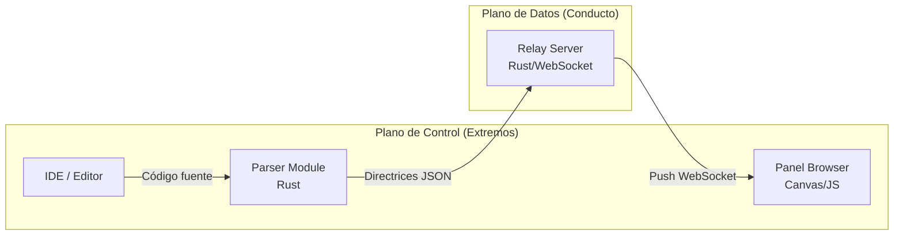
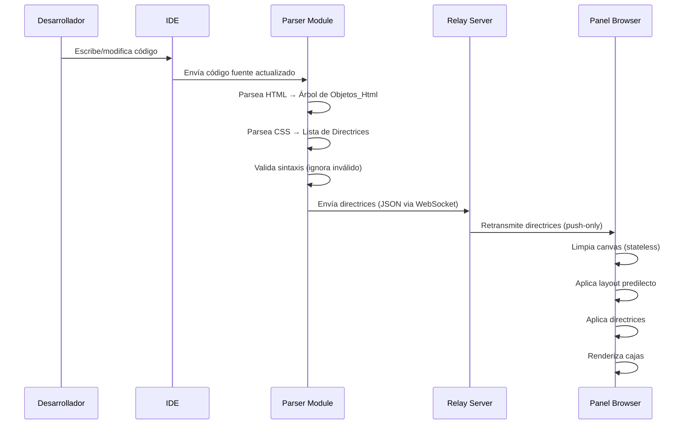

# Design Document: Real Time MVP

## Overview

Real Time es un motor de renderizado intermedio que conecta el IDE del desarrollador con un Panel_Browser mediante un Relay_Server. El flujo es unidireccional (push-only): el código HTML/CSS se parsea en el lado del IDE, se transmite como directrices a través de un WebSocket relay, y el Panel_Browser renderiza cajas geométricas stateless que representan la estructura del documento.

El MVP se enfoca en un solo usuario, soporte para etiquetas HTML semánticas básicas, propiedades CSS de layout y posicionamiento, y un ciclo de retroalimentación visual en tiempo real.

## Architecture



El sistema se divide en tres módulos principales:

1. **Parser Module** (Rust): Recibe el código fuente, parsea HTML y CSS, genera directrices. Vive junto al IDE como proceso local.
2. **Relay Server** (Rust): WebSocket server que actúa como conducto ciego. No inspecciona ni transforma los datos.
3. **Panel Browser** (JavaScript/Canvas): Recibe directrices y renderiza cajas geométricas en un canvas HTML5.

### Flujo de datos



## Components and Interfaces

### Parser Module

Responsable de convertir código fuente en directrices transmisibles.

**Sub-componentes:**

- **HTMLParser**: Parsea HTML y genera un árbol de `Objeto_Html`.
- **CSSParser**: Parsea CSS y genera una lista de `Directriz`.
- **Validator**: Filtra sintaxis inválida. Solo pasa directrices con sintaxis correcta.
- **Serializer**: Convierte el árbol de objetos y directrices a JSON para transmisión.
- **PrettyPrinter_HTML**: Convierte un árbol de `Objeto_Html` de vuelta a HTML válido.
- **PrettyPrinter_CSS**: Convierte una lista de `Directriz` de vuelta a CSS válido.

**Interfaz de salida (JSON):**

```rust
// Mensaje que se envía al Relay
pub struct RenderMessage {
    pub objects: Vec<ObjetoHtml>,
    pub directives: Vec<Directriz>,
    pub timestamp: u64,
}
```

**Librerías candidatas (Rust):**
- HTML parsing: `html5ever` (estándar de facto, usado por Servo) o `lol_html` (streaming, bajo consumo de memoria)
- CSS parsing: `lightningcss` (extremadamente rápido, mantenido por Parcel) o `cssparser` (bajo nivel, base de Servo)
- Serialización: `serde` + `serde_json`

**Decisión**: Para el MVP, usar `html5ever` para HTML (robusto, tolerante a errores) y `lightningcss` para CSS (rápido, API de alto nivel). Ambos son proyectos maduros con comunidad activa.

### Relay Server

Conducto ciego de WebSocket.

```rust
// Pseudocódigo del relay
async fn relay(ws_ide: WebSocket, ws_browser: WebSocket) {
    while let Some(msg) = ws_ide.recv().await {
        ws_browser.send(msg).await;
    }
}
```

**Librería**: `tokio` + `tokio-tungstenite` para WebSocket async de alto rendimiento.

**Responsabilidades:**
- Aceptar conexión del Parser Module (productor)
- Aceptar conexión del Panel Browser (consumidor)
- Retransmitir mensajes sin inspección
- Manejar reconexión automática

**No hace:**
- Deserializar mensajes
- Validar contenido
- Almacenar estado

### Panel Browser (Renderer)

Aplicación JavaScript que corre en el browser y renderiza cajas en un canvas HTML5.

**Sub-componentes:**

- **WebSocketClient**: Recibe directrices del Relay.
- **LayoutEngine**: Calcula posiciones según estructuración predilecta y directrices.
- **BoxRenderer**: Dibuja cajas geométricas en el canvas con bordes y etiquetas.

**Interfaz de entrada:**

```typescript
interface ObjetoHtml {
  id: string;
  tag: string;
  children: ObjetoHtml[];
  attributes: Record<string, string>;
}

interface Directriz {
  selector: string;
  property: string;
  value: string;
}

interface RenderMessage {
  objects: ObjetoHtml[];
  directives: Directriz[];
  timestamp: number;
}
```

**Ciclo de renderizado (stateless):**
1. Recibir `RenderMessage`
2. Limpiar canvas completamente
3. Construir layout tree desde `objects` con posiciones predilectas
4. Aplicar `directives` sobre el layout tree
5. Dibujar cajas en canvas


### Reglas de Estructuración Predilecta (LayoutEngine)

```typescript
const PREDILECT_POSITIONS: Record<string, LayoutRule> = {
  'header':  { zone: 'top',    order: 0, width: '100%' },
  'nav':     { zone: 'top',    order: 1, width: '100%' },
  'section': { zone: 'center', order: 2, width: '80%'  },
  'div':     { zone: 'center', order: 3, width: '60%'  },
  'footer':  { zone: 'bottom', order: 0, width: '100%' },
};

// Elementos con rol background
const BACKGROUND_TAGS = ['background'];
// Imágenes con atributo role="background" o class que contenga "background"/"banner"
// → width: 100%, height: 100%, z-index: -1
```

El LayoutEngine divide el canvas en tres zonas verticales: top, center, bottom. Los elementos se apilan dentro de su zona según el orden de aparición en el HTML, respetando la prioridad predilecta.

## Data Models

### Objeto_Html (Rust)

```rust
use serde::{Serialize, Deserialize};

#[derive(Debug, Clone, Serialize, Deserialize, PartialEq)]
pub struct ObjetoHtml {
    pub id: String,
    pub tag: String,
    pub children: Vec<ObjetoHtml>,
    pub attributes: Vec<(String, String)>,
}
```

### Directriz (Rust)

```rust
#[derive(Debug, Clone, Serialize, Deserialize, PartialEq)]
pub struct Directriz {
    pub selector: String,
    pub property: String,
    pub value: String,
}
```

### RenderMessage (Rust)

```rust
#[derive(Debug, Clone, Serialize, Deserialize, PartialEq)]
pub struct RenderMessage {
    pub objects: Vec<ObjetoHtml>,
    pub directives: Vec<Directriz>,
    pub timestamp: u64,
}
```

### LayoutNode (TypeScript - Panel Browser)

```typescript
interface LayoutNode {
  id: string;
  tag: string;
  x: number;
  y: number;
  width: number;
  height: number;
  children: LayoutNode[];
  directives: Directriz[];
  zone: 'top' | 'center' | 'bottom' | 'background';
}
```


## Correctness Properties

*A property is a characteristic or behavior that should hold true across all valid executions of a system—essentially, a formal statement about what the system should do. Properties serve as the bridge between human-readable specifications and machine-verifiable correctness guarantees.*

### Property 1: HTML parsing preserves structure

*For any* valid HTML string containing tags with arbitrary nesting, parsing it into an Objeto_Html tree SHALL produce a tree where each node's tag matches the original HTML tag, and the parent-child relationships match the nesting in the source HTML.

**Validates: Requirements 1.1, 1.2**

### Property 2: HTML round-trip

*For any* valid Objeto_Html tree, printing it to HTML and then parsing the result back SHALL produce an Objeto_Html tree equivalent to the original.

**Validates: Requirements 1.5, 1.6**

### Property 3: Tag removal produces correct tree

*For any* valid HTML string and any tag within it, removing that tag from the source and re-parsing SHALL produce an Objeto_Html tree that does not contain a node with that tag's id.

**Validates: Requirements 1.3**

### Property 4: Semantic tag zone assignment

*For any* Objeto_Html with a semantic tag (header, nav, footer, section, div), the Motor_Layout SHALL assign it to the correct predilect zone: header and nav to "top", section and div to "center", footer to "bottom".

**Validates: Requirements 2.1, 2.2, 2.3, 2.4, 2.5**

### Property 5: Background elements full-page positioning

*For any* Objeto_Html with role of background, the Motor_Layout SHALL assign it width and height equal to the full page dimensions and a z-index lower than all other non-background elements.

**Validates: Requirements 2.6**

### Property 6: CSS parsing produces correct directives

*For any* valid CSS rule string, parsing it SHALL produce a Directriz with the correct selector, property, and value matching the source CSS.

**Validates: Requirements 3.1**

### Property 7: CSS round-trip

*For any* valid Directriz, printing it to CSS and then parsing the result back SHALL produce a Directriz equivalent to the original.

**Validates: Requirements 3.4, 3.5**

### Property 8: Directive modification updates rendering state

*For any* set of Directrices applied to an Objeto_Html, modifying the value of one Directriz and re-rendering SHALL produce a layout where the affected Objeto_Html reflects the new value, and all other Objetos_Html remain unchanged.

**Validates: Requirements 4.1**

### Property 9: Directive removal reverts to base state

*For any* set of Directrices and any single Directriz within that set, removing it and re-rendering SHALL produce a result equivalent to rendering the set without that Directriz from the start.

**Validates: Requirements 4.2**

### Property 10: Stateless rendering idempotence

*For any* set of Objetos_Html and Directrices, rendering the same input twice SHALL produce identical output, regardless of any previous rendering state or history.

**Validates: Requirements 4.3, 4.4**

### Property 11: Relay transparency

*For any* message sent through the Relay_Server, the output bytes SHALL be identical to the input bytes, with no transformation, filtering, or reordering.

**Validates: Requirements 5.1**

### Property 12: Box rendering includes identification

*For any* Objeto_Html, the rendered box SHALL include visible borders and a text label matching the tag name of the Objeto_Html.

**Validates: Requirements 6.1**

### Property 13: Nested boxes spatial containment

*For any* Objeto_Html that contains child Objetos_Html, the bounding rectangle of each child box SHALL be fully contained within the bounding rectangle of the parent box.

**Validates: Requirements 6.2**

## Error Handling

### Parser Errors (Diseño Defensivo)

- HTML incompleto o inválido: el Parser_HTML produce el mejor árbol parcial posible y descarta las porciones inválidas. El Panel_Browser muestra el último estado estable.
- CSS incompleto o inválido: el Parser_CSS ignora la regla inválida. No se genera Directriz. El Objeto_Html mantiene su estado actual.
- El parser nunca crashea ni propaga errores al Relay o al Browser.

### Relay Errors

- Desconexión del Browser: el Relay almacena temporalmente el último RenderMessage. Al reconectar, lo re-envía para restaurar el estado.
- Desconexión del IDE/Parser: el Relay mantiene la conexión con el Browser abierta. El Browser mantiene su último estado renderizado.

### Browser Errors

- Mensaje JSON malformado: se ignora y se mantiene el último estado renderizado.
- Canvas overflow (demasiados elementos): se aplica un límite máximo de elementos renderizados con indicador visual de truncamiento.

## Testing Strategy

### Framework y Herramientas

- **Rust (Parser + Relay)**: `cargo test` con `proptest` para property-based testing
- **TypeScript (Panel Browser)**: `vitest` con `fast-check` para property-based testing
- **Integración**: Tests end-to-end con WebSocket mock

### Property-Based Testing

Cada propiedad de correctitud se implementa como un test con `proptest` (Rust) o `fast-check` (TypeScript):

- Mínimo 100 iteraciones por propiedad
- Cada test anotado con: **Feature: real-time-mvp, Property {N}: {título}**
- Generadores inteligentes que producen HTML/CSS válido con estructura variable

### Unit Testing

Tests unitarios complementarios para:

- Casos específicos de etiquetas semánticas conocidas
- Edge cases: HTML vacío, CSS sin propiedades, anidación profunda
- Errores de sintaxis específicos que deben ser tolerados
- Integración WebSocket (conexión, desconexión, reconexión)

### Cobertura

- Cada requisito tiene al menos una propiedad o test unitario que lo valida
- Los edge cases (1.4, 3.2, 5.4) se cubren con generadores que incluyen entradas inválidas y con tests unitarios específicos
